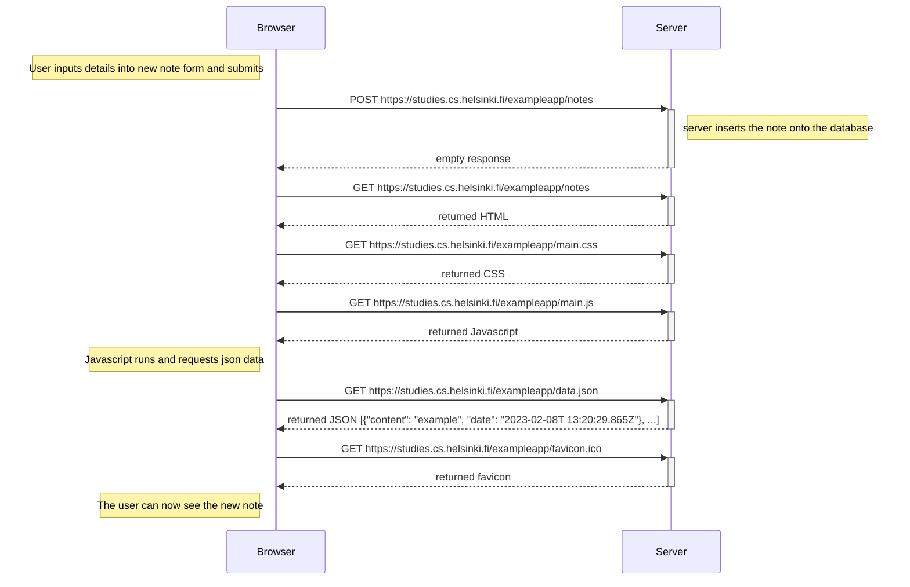

Here is a sequence diagram for a successful new note insert attempt:

```mermaid
sequenceDiagram
    note left of Browser: User inputs details into new note form and submits

    Browser->>+Server: POST https://studies.cs.helsinki.fi/exampleapp/notes
    
    note right of Server: server inserts the note onto the database
    
    Server-->>-Browser: empty response
    
    Browser->>+Server: GET https://studies.cs.helsinki.fi/exampleapp/notes
    Server-->>-Browser: returned HTML
    
    Browser->>+Server: GET https://studies.cs.helsinki.fi/exampleapp/main.css
    Server-->>-Browser: returned CSS
    
        Browser->>+Server: GET https://studies.cs.helsinki.fi/exampleapp/main.js
    Server-->>-Browser: returned Javascript
    
    note left of Browser: Javascript runs and requests json data
    
    Browser->>+Server: GET https://studies.cs.helsinki.fi/exampleapp/data.json
    Server-->>-Browser: returned JSON [{"content": "example", "date": "2023-02-08T 13:20:29.865Z"}, ...]

    Browser->>+Server: GET https://studies.cs.helsinki.fi/exampleapp/favicon.ico
    Server-->>-Browser: returned favicon

    note left of Browser: The user can now see the new note
  
```
